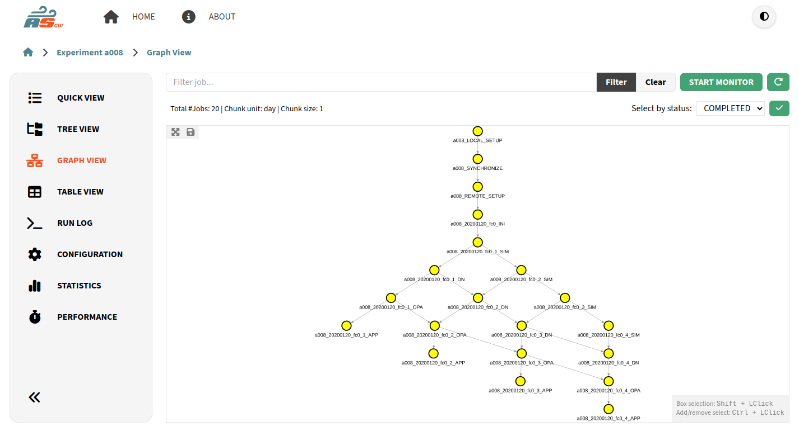

.. _graphRepresentation:

Graph View
====================

The Experiment Graph View provides a dependency oriented view where a node represents a job and an edge represents a directed dependency relationship between jobs.

    Experiment Graph View

Graph Viewport
---------------

The color of each node represents its ``status`` and below of each node you can see its ``job name``. You can also use your mouse or trackpad to navigate the graph viewport, zoom in or zoom out.

On the top left part of the viewport, you have an option to fit all the graph elements in the viewport or save the current view as a PNG format image.

.. note:: For some experiments you will get a well distributed and generally good looking graph representation, for others you get a more straightforward representation. It depends on the size and dependency complexity of your experiments, not all experiments can be modeled as a good looking graph in reasonable time.

You can select many nodes at the same time by maintaining ``Shift`` or ``Ctrl`` pressed with ``Click``, and dragging on the viewport. You can add or remove individual nodes as well by doing ``Shift`` or ``Ctrl`` plus ``Click`` one node.

When you click on a node, you can see collapsible bottom ``Job Panel`` appear. You can expand/collapse it by double clicking its header or clicking the angle up/down button.

    Experiment Graph Panel

.. include:: ../tree/jobpanel.rst

Monitoring
----------

If applicable, you will see at the top right corner the button ``START MONITOR``. When you click on it, a **background process** will be initialized and the data of the jobs will be refreshed every certain amount of time. Any change will be updated in the graph. 

You can stop this process by clicking on the button ``STOP MONITOR``.

.. note:: While this is a good option to monitor the progress of your experiment, you can also use the :ref:`log` as an alternative.

Job Search
----------

On top of the graph you will see an input text box following by the button ``Search``. You can type a substring to search among the name of all the nodes. Once ``Search`` button is clicked or pressed ``Enter``, all the match nodes will be selected.

Additionally, you can select by status on the top right side. This will select all the nodes the match a certain status. 

Wrappers Representation
-----------------------

Wrappers are an important feature of Autosubmit, and as such, it should be possible to visualize them in the graph representation. They are represented as a rectangular box with dashed border that will wrap the jobs inside it.

   Graph Wrapper Representation

If you want to select the nodes inside it you can do ``Shift`` or ``Ctrl`` plus ``Double Click`` the box.
