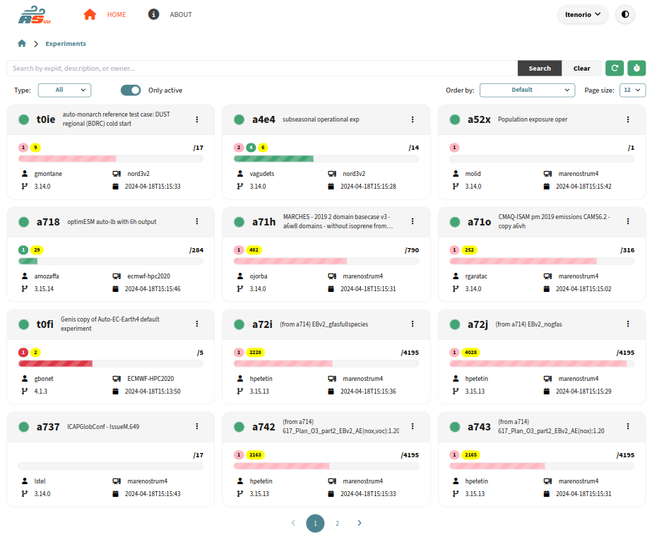

.. _home:

Main Page
========================

When you enter the site (and authenticated, if applicable), you will be presented with the following page: 

   Home page

For each experiment, you see the following data (from top left to bottom right):

- *Status*: It will be shown in the circle at the top left side. *ACTIVE* if green, otherwhise *INACTIVE*. 
- *Experiment Name*: e.g. *t0ie*.
- *Description*: Textual description of the experiment.
- *Number of Jobs*: On the top of the progress bar. On the right, the **total jobs**. On the left, **running** (green), **failed** (red), **queued** (pink), and **completed** (yellow).
- *Progress Bar*: Shows completed jobs / total jobs. It turns red when there are **failed** jobs, or pink when there are **queued** jobs, or green.
- *Owner*: User that owns the experiment directory.
- *HPC*: Default HPC that was set in the config.
- *Autosubmit version*
- *Modification date*

Search
---------

Here you can search for any ongoing or past experiment by typing some text in the Search input box and pressing **Search**. Then, the search engine will look for coincidences between your input string and any of the description, owner or name of the experiment fields. 

Also, you can filter results by experiment type (``Normal Experiment``, ``Test``, or ``Operational``) and by status (``ACTIVE`` or ``INACTIVE``).

Results can be ordered by Experiment name (``expid``) or by Creation date. Also, the size of the page can be changed.

At the right side of the search bar, you can click on the *"more filters"* button to filter by owner, Autosubmit version, or HPC. This search also allows to use wildcards (``*``) and negation (``!``) symbols. For example, if you want to search for all the experiments that are not owned by the users which name starts with the letter "a", you can type ``!a*`` in the owner filter.