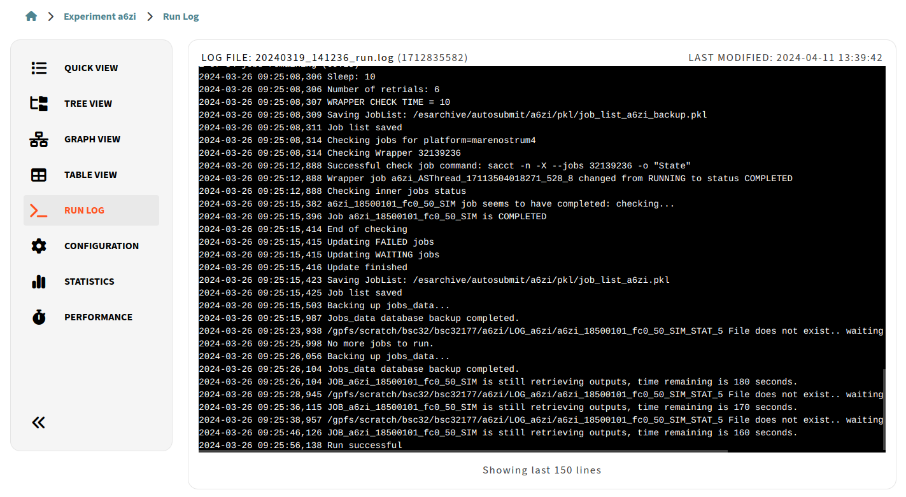

.. _log:

Run Log
==============

The Experiment Run Log page will show you the last 150 lines of the latest run log:

   Experiment Log Open

At the top of the log you will see the name of the log file that is being displayed along with the timestamp of the last time the log was requested, and to the right you see this timestamp in ``datetime`` format.
  
While you are in this view, if the experiment is currently running, the log will be updated periodically to keep you up with recent updates in the experiment execution. It is possible to scroll this view.

.. important:: The main Autosubmit log is usually stored in the folder ``/tmp/`` of your experiment, and this is the first path the system will scan.
