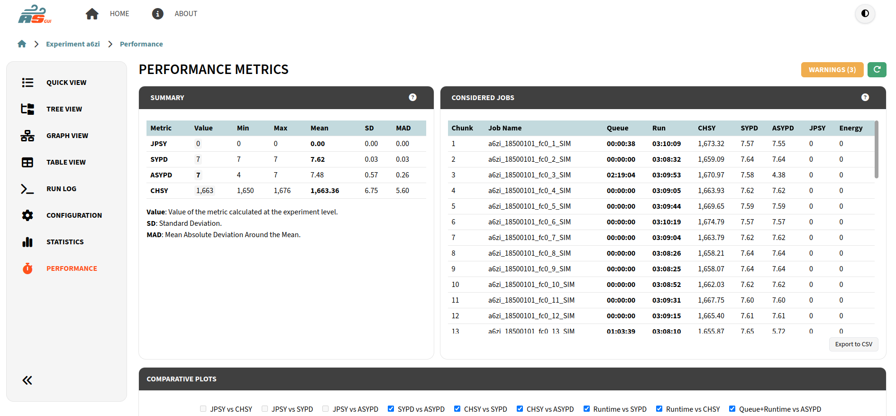

.. _performance:

Performance Metrics
===================

The Performance Metrics page offers a set of metrics that try to measure the efficiency of the simulation performed, and other aspects of it.

   Performance Metrics Page

On the left you have the values of the main performance metrics that apply to the experiment. Then, on the right, you see the list of jobs considered for this calculation with their data, also, ``SYPD`` and ``PSYPD`` are calculated individually for these jobs. This list is scrollable.

You can also access a ``WARNINGS`` button that opens a modal with the list of important information that might affect the calculation of the metrics.

Further information about the metrics is included in this page by clicking to the ``?`` button.