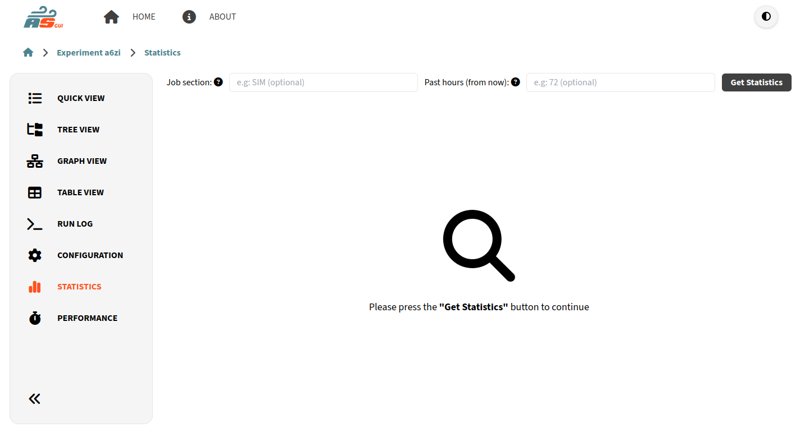
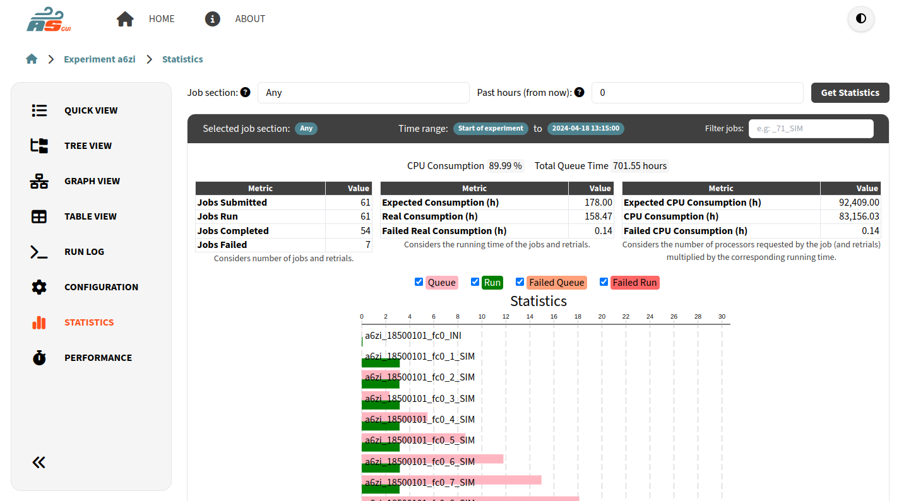

.. _statistics:

Statistics
=====================

In the Experiment Statistics page, first, you will see two input boxes: ``Job Section`` and ``Past hours (from now)``, followed by the button ``Get Statistics``:

   Experiment Statistics page

There is also a brief explanation of the input fields when hovering the ``?`` icon. Basically, ``Job Section`` allows you to narrow your search to certain job section, and ``Past Hours`` allows you to set a time limit to look into the past in hours.

.. important:: ``Job Section`` and ``Past hours (from now)`` are optional inputs. If none if provided, they'll set to ``Any`` (all jobs) and ``0`` (from the start of the experiment), respectively.

Clicking to ``Get Statistics`` will show you the results of the statistics calculation like this: 

   Experiment Statistics Results

