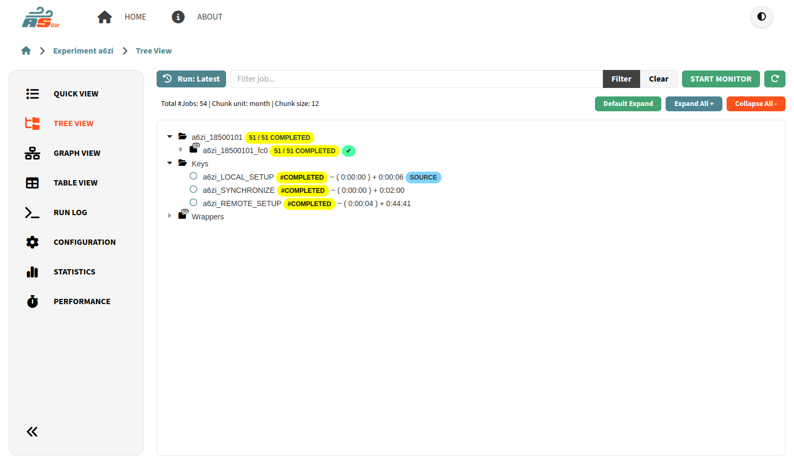
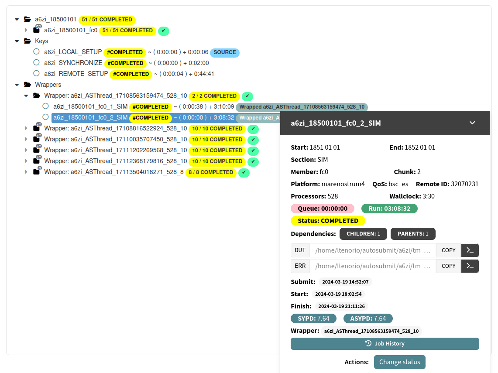

.. _treeRepresentation:

Tree View
=================================

The Tree Representation offers a structured view of the experiment.

   Experiment Tree View

The view is organized in groups by ``date``, and ``date-member``. Each group has a folder icon, and next to the icon you can find the progress of the group as ``completed / total`` jobs (when all the jobs in a group have been completed, a check symbol will appear); then, an indicator of how many jobs inside that group are **RUNNING**, **QUEUING**, or have **FAILED**. 

Furthermore, if wrappers exist in the experiment, these will be enclosed in the  ``wrappers`` folder sorted by running time. independent groups will be added for each wrapper that will contain the list of jobs included in the corresponding wrapper. This implies that a job can be repeated: once inside its ``date-member`` group and once in its wrapper group.

Inside each group you will find the list of jobs that belong to that group. The jobs are shown following this format: *job name* + # *job status* + ( + *queuing time* + ) + *running time*. Jobs that belong to a wrapper have also a badge with the code of the wrapper.

The ``date-member`` folders will be displayed collapsed if all jobs inside a given folder have status COMPLETED, SUSPENDED or WAITING. 

The user also can expand and collapse all the items of the tree by clicking the corresponding buttons located in the toolbar above.

When you click on an item, you can see collapsible bottom ``Job Panel`` appear. You can expand/collapse it by double clicking its header or clicking the angle up/down button.

.. note:: Additionally, you can select many jobs at the same time by maintaining ``CTRL`` pressed and clicking on the jobs.

   Experiment Panel

.. include:: jobpanel.rst

Monitoring
----------

If applicable, you will see at the top right corner the button ``START MONITOR``. When you click on it, a **background process** will be initialized and the data of the jobs will be refreshed every certain amount of time. Any change will be updated in the tree.

You can stop this process by clicking on the button ``STOP MONITOR``.

Filter
------

At the top left you can find the **Filter text** input box. Insert any substring and the list will show only those jobs whose description coincides with that string. 

For example, ``#COMPLETED`` will show only completed jobs, ``Wrapped`` will show only those jobs that belong to a wrapper, ``_fc0_`` will show only those jobs that belong to the fc0 member. Press **Clear** to reset the filter. 

Down the search bar, you will see the total number of jobs, and the chunk unit used in the experiment.

.. note:: This view is designed to show a structured view of your experiment, if you want a more dependency oriented view that shows better the execution sequence of your jobs, you can refer to :ref:`graphRepresentation`.

