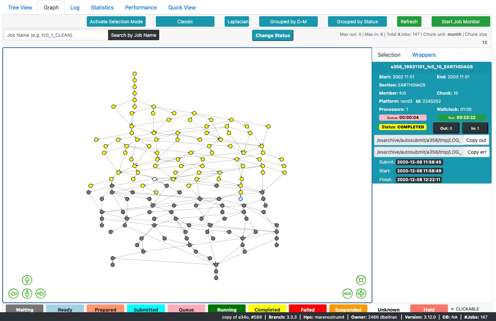

# Summary

`Autosubmit GUI` is a front-end software developed using **Javascript** and **ReactJS** that aims to provide users with complex information from the workflow execution of scientific experiments (managed by `Autosubmit`) in any system, but mainly **High-Performance Computing (HPC)** platforms.
`Autosubmit` [@autosubmit] is a Python-based workflow manager able to handle complex tasks involving different sub-steps (e.g., scientific computational experiments). These steps or jobs are executed in one or multiple computing systems (platforms), from High-Performance Computers to small clusters or workstations. The workflow manager is able to orchestrate the jobs that constitute the workflow while respecting their dependencies and handling errors.

This front-end software consumes information served by an API (`Autosubmit API` [@api]) that collects data from the execution of experiment workflows. An experiment can be seen as a task that can be decomposed into different sub-steps with established inter-dependencies. The execution of an experiment and its jobs may generate a high amount of information that needs to be processed so users can visualize it. `Autosubmit API` summarizes this information and presents it as API requests. `Autosubmit GUI` consumes these API requests and shows the information available in a condensed, comprehensive, and dynamic way. `Autosubmit GUI` uses three highly popular and useful libraries: `FancyTree` [@fancytree], `vis.js` [@visjs], and `react-google-charts` [@reactgoogle]; among other web resources that facilitate the visualization of information and information updates.

The visual approach to experiment workflow management is not new in the High-Performance Computing scenario. As two widely adopted tools, we have `Cylc` [@cylc] and `ecFlow` [@ecflow]. `Autosubmit GUI` attempts to present a development template for those willing to work in a web environment to develop tools for progress monitoring purposes.

# Statement of need

The number of jobs in an experiment workflow (managed by `Autosubmit`) ranges from one to several thousand. The jobs can vary in the type of task they perform, from data retrieval to complex climate simulations. The result of the execution of an experiment workflow is usually large amounts of information. Access to this information is possible through the file system or terminal commands (provided by `Autosubmit`). Experiment workflow monitoring is possible through `Autosubmit`; the program checks the output of the experiment's jobs, logs, and job status in the remote platform or workstation. Then, `Autosubmit` summarizes progress and status information in a graph representation as a `pdf` file. `Autosubmit` can also show the workflow status information as a `txt` file where the jobs and their status are listed. Although they fulfill the purpose of experiment monitoring, these ways of presenting workflow information fall short once the experiments grow in the number of jobs involved and associated dependencies. Therefore, our users needed a more optimal, accessible, and interactive technology to access their experiments' status and other artifacts product of the jobs' execution. The Autosubmit development team chose a web architecture as a solution that would allow to quickly deploy (and update) this service with minimum requirements for users. Furthermore, this choice would allow developers to reuse existing technology, in the form of open-source visualization libraries, to let `Autosubmit GUI` show information in a graphical way. Since the amount of information we need to show is considerable, the development team focused on optimization and little loading times.

As mentioned, the primary experiment workflow status representation generated by the users of `Autosubmit` is a graph generated through `Graphviz` in a `pdf` file. Consequently, that was the first representation we tried to mimic in `Autosubmit GUI`. For this purpose, we chose `vis.js`, a proven `Javascript` library that implements graph representations for the provided data. This library also provides a rich API to manipulate its representation and dynamically update its data. In our implementation, we present several ways to access the `vis.js` objects and adapt them to our necessities in concordance with the requirements of `ReactJS`. We avoid unnecessary refreshes of the graph component by storing it in the `ReactJS` internal state. We believe that our implementation can guide those willing to work with graph representations in a web environment.

Later, `Autosubmit GUI` was required to implement an experiment workflow representation that showed more information at first glance, arranging jobs hierarchically. As a result, we decided to implement a tree view based on `FancyTree`, a `Javascript` library. This library provides a rich API that allowed us to implement a structured visualization of the experiment workflow. Again, we adapted this library to work smoothly with `ReactJS`. By directly accessing the internal component infrastructure, we achieved smooth updates of the tree's information. It is also an excellent example of how to use the tools provided by this library. Moreover, we use `react-google-charts` to display statistics generated by the experiment workflow execution.

Finally, we discuss a little about our programming language and framework choice. **Javascript** was the obvious, and perhaps required, selection in this respect. This programming language has taken over the Web and is becoming a standard, for better or worse. For our front-end purposes, it has all the tools that we needed and gives us access to a variety of useful extensions. The central vision of `Autosubmit GUI` was to develop a graphical interface that showed as much information as possible at first glance; moreover, this interface should be scalable, with additional required information taking an area of the browser window. We decided that the interface should be divided into modules that would be displayed in a tiled design. The interface should update the modules (tiles) individually and independently without affecting general performance. **ReactJS** provides the tools to accomplish this purpose, where we can translate our idea of modules to _components_. So, it was the chosen framework.

# Main features

- Users can search for experiments that match specific criteria: Currently active experiments (those on execution), experiments belonging to a particular user, description of experiments that contain a specific word, and other filters. `Autosubmit GUI` presents the result in a main window \autoref{fig:mainwindow} where the user can monitor the experiment's progress and additional relevant information. Each experiment item gives direct access to the experiment representation (tree view by default) or a _quick view_ that displays only the essential information. From the experiment item, there is an option to see a summary of the experiment's current progress.

- Users can see the representation of their experiment in three ways with some variations:
  - **Tree View** \autoref{fig:treeview}: Uses `FancyTree` to present the experiment jobs in a structured and hierarchical fashion.
  - **Graph View** \autoref{fig:graphview}: Uses `vis.js` to present the experiment jobs in a graph.
  - **Quick View**: Uses `FancyTree` to present a browsable list of the experiment jobs.

- All experiment representations allow searching for jobs by name or by patterns in the job's name using the `*` wildcard.
- The graph view presents representation variations for ease of usage.
- The graph and tree views allow the user to view detailed information about a job by clicking on its associated node or item.
- The graph view allows the user to select some nodes (jobs) and generate an Autosubmit command to type in a terminal through the `Change Status` button.
- The tree view allows the user to select some items (jobs) and generate a command through the `Activate Selection Mode` button.
- The user can set experiments that are `ACTIVE` (shown at the top of the page next to the experiment identifier) to be automatically updated according to changes in real-time. The user can do this by pushing the `Start Job Monitor` button. Then, `Autosubmit GUI` will query the API from time to time and update the graph or tree representation with the job changes. This functionality doesn't prompt a full component rerender; instead, the interface updates the nodes or items individually and independently.
- The user can visualize the last 100 lines of the experiment's log.
- The interface provides statistics of the workflow execution through the `Statistics` tab using `react-google-charts`.
- The interface provides performance metrics of the experiment in the `Performance` tab. The metrics that the interface shows in this section, and their calculation, are based on [@performance].
- The interface displays historical data for the experiment and its indiviual jobs.

<!-- # Citations -->

<!-- Work in progress -->

<!-- If you want to cite a software repository URL (e.g. something on GitHub without a preferred
citation) then you can do it with the example BibTeX entry below for @fidgit.

For a quick reference, the following citation commands can be used. -->

<!-- # Figures

Work in progress. -->

# Acknowledgements

We acknowledge contributions from Francisco Doblas-Reyes, Kim Serradell, and all our **Earth Science Department** users.

# References
